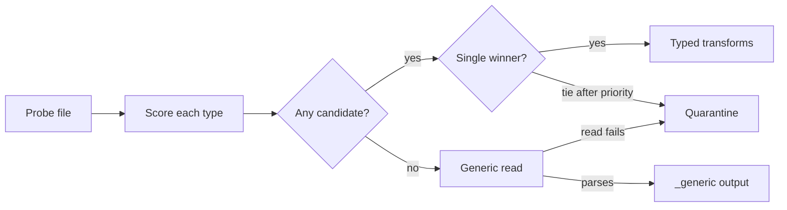

# Conflux: .NET 10 Data Pipeline Library Spec

> **Design input, not shipped API.** This spec is being folded into DataBall (no separate Conflux product). Decisions and the proposed v1.4.0 slices are in the suite's `docs/databall-v1.4-alignment.md`.

Oct 8, 2026

## Overview

Conflux (working name) is a cross-platform .NET 10 library, CLI and optional TUI that detects custom CSV and Parquet files, routes each to a type-specific transformation, combines them, and exports Parquet or CSV. One command with no configuration should do the right thing for known file types; JSON pipelines add control when needed.

**Goals**

- Detect each input's file type from content, file name and extension, with an explainable score.
- Apply per-type transformations, then union, schema-merge, join, aggregate and dedupe across inputs.
- Export through named profiles, with output files split by content.
- Handle inputs from a few KB to well beyond RAM without a code change.
- Run identically on Windows, Linux and macOS (x64 and arm64).

**Non-goals for v1**

- Cloud storage (S3, Azure Blob, GCS); local and network disk only.
- Multiple record layouts inside one file.
- A server, scheduler or web UI. Watch mode covers unattended use.

**Decisions from the interview**

| Topic | Decision |
| --- | --- |
| Data volume | Varies widely, so out-of-core processing is required |
| Engine | Embedded DuckDB via DuckDB.NET |
| Rules and transforms | Declarative JSON for common cases, C# plugins for complex logic |
| Combining | Union, schema merge, keyed joins, aggregate and dedupe |
| CSV quirks | Preamble/trailer lines and odd formatting; mostly standard otherwise |
| Unmatched or ambiguous files | Highest score wins; no match tries a generic transform; failure goes to quarantine |
| Bad rows | Fail on first error |
| Export | Named profiles plus custom content-based splits |
| Pipelines | Automatic with one command; optional JSON definitions; bundled defaults for our use cases |
| TUI | Progress monitor, data preview and pipeline builder |
| Storage | Local/network disk and watch folders |
| Distribution | dotnet global tool |

## Architecture

All data work runs inside an embedded DuckDB database; C# code plans the work, generates SQL and orchestrates. This keeps memory flat for files larger than RAM, because DuckDB streams CSV and Parquet and spills joins and sorts to disk.

### Projects

One solution (`.slnx`, central package management), all targeting `net10.0` with nullable reference types on.

| Project | Ships as | Responsibility | Key dependencies |
| --- | --- | --- | --- |
| Conflux.Abstractions | NuGet library | Plugin contracts: `IFileTypeDetector`, `ITransform`, `ISplitStrategy`, `IFileNormalizer`. Plugin authors reference only this. | Microsoft.Extensions.Logging.Abstractions |
| Conflux.Core | NuGet library | Run orchestration, detection engine, rule evaluation, planner, type registry | Abstractions, Microsoft.Extensions.* |
| Conflux.Csv | NuGet library | File probing, encoding and dialect sniffing, preamble/trailer extraction, normalizer | None (BCL only) |
| Conflux.Engine.DuckDb | NuGet library | SQL generation, reads, writes, C# UDF registration | DuckDB.NET.Data.Full 1.5+ |
| Conflux.Pipelines | NuGet library | JSON pipeline and type-definition models, JSON Schema, validation, bundled defaults as embedded resources | System.Text.Json (source-generated) |
| Conflux.Watch | NuGet library | Watch-folder service | Microsoft.Extensions.Hosting |
| Conflux.Cli | dotnet tool `conflux` | Commands, console progress, exit codes | System.CommandLine 2.0, Spectre.Console |
| Conflux.Tui | Assembly inside the tool | Monitor, preview and pipeline-builder screens, loaded only by `conflux tui` | Terminal.Gui 2.5 |
| Conflux.Types.Bundled | Assembly inside the tool | Our file-type definitions, plugins and default pipelines | Abstractions |
| Conflux.Tests.* | Not shipped | Unit, golden-file and CLI tests | xUnit, Verify |

### Run-scoped engine

Each run opens one DuckDB database file in a run temp folder, not an in-memory database, so large intermediates can spill. `memory_limit`, `threads` and `temp_directory` come from config, with defaults of 75% of RAM, all cores and the OS temp folder. Each stage adds a view; the planner materializes a temp table only before a join, a dedupe, or a managed C# transform. The temp folder is deleted on success and kept on failure for diagnosis.

### Processing stages

1. **Discover**: expand paths, globs and folders into a file list.
2. **Probe**: read the first 64 KB of each file; sniff encoding, dialect, header and preamble.
3. **Detect**: score every file type; route to the winner, the generic type, or quarantine.
4. **Read**: build a DuckDB relation per file, as all-text columns.
5. **Validate and cast**: apply the type's schema; stop on the first bad value.
6. **Type transforms**: run the file type's own transform chain.
7. **Combine**: union, schema-merge, join, aggregate and dedupe.
8. **Post-combine transforms**: optional transforms on the combined result.
9. **Split and write**: apply the export profile and split rules; write to a staging folder.
10. **Commit**: move outputs into place and write the run manifest.

## File detection and routing

Every input is probed once, scored against every registered file type, and routed to exactly one of three places: its winning type, the generic type, or quarantine. Detection never reads past the first 64 KB, so it costs the same for a 1 KB file and a 50 GB file.



A tie that priority can't break goes to quarantine, as does a file the generic reader can't parse.

### Probe

The probe is an immutable `FileProbe` record built from the file's head (and tail, for trailers), in parallel across files.

- **Identity**: path, file name, extension, size, last-write time.
- **Encoding**: BOM if present, else UTF-8 validity check, else the configured fallback (default Windows-1252).
- **Dialect guess**: delimiter chosen by field-count consistency across `,` `;` tab `|`; quote and escape characters.
- **Layout guess**: preamble lines, header row index, header column names, trailer lines.
- **Parquet**: magic bytes `PAR1` at both ends, plus column names and types from the footer.
- **Captures**: named regex groups from file-name rules, e.g. `site` and `date`, available later as variables.

### Rules

A file type's `detect` block lists weighted conditions. Any condition can be marked `required`, which gates the type to a score of zero when it fails.

| Condition | Matches when | Example |
| --- | --- | --- |
| `fileName` | Name matches a glob | `INV_*.csv` |
| `fileNameRegex` | Name matches a regex; named groups become captures | `^(?<site>[A-Z]{3})_inv_(?<date>\d{8})` |
| `extension` | Extension is in a list | `[".csv", ".txt", ".dat"]` |
| `headerContainsAll` | All listed columns (or their aliases) are present, case-insensitive | `["InvoiceId", "Amount"]` |
| `headerExact` | Header equals the list, in order | `["Id", "Sku", "Qty"]` |
| `lineMatches` | A given line, or any of the first N lines, matches a regex | line 0: `^Report:\s+Inventory` |
| `preambleKey` | Preamble has a key, optionally with a value regex | `Source` = `^ERP` |
| `columnCount` | Column count is within a range | `12..14` |
| `parquetColumns` | Parquet schema contains the columns | `["event_id", "ts"]` |

C# detectors implement `IFileTypeDetector.Score(FileProbe)` and return a score from 0 to 1 plus human-readable reasons. A type may combine declarative conditions with a C# detector; the type's score is then the weighted average of both.

### Scoring and ambiguity

- A type's score is matched weight divided by total weight, from 0 to 1.
- A type is a candidate when its score is at least its `minScore` (default 0.6).
- The highest-scoring candidate wins; equal scores are broken by the type's `priority`.
- Still tied after priority: the file is quarantined as ambiguous.
- No candidate: the file goes to the generic type (below).

### Generic fallback

The built-in `generic-csv` and `generic-parquet` types accept any file the sniffer can parse. They use the sniffed dialect, DuckDB type inference, header names normalized to snake_case with duplicates suffixed, and the standard lineage columns. Their output goes to a separate `_generic` output set and is never combined with typed data unless a pipeline asks for it. If the generic read fails, the file is quarantined.

### Quarantine

Quarantined files are copied (moved in watch mode) to `<output>/_quarantine/<runId>/`, each with a `<file>.reason.json` holding every type's score and reasons. Quarantine is a file-level routing outcome, not a data error, so it does not fail the run; exit code 3 reports it. `conflux detect --explain` prints the same scoring table without processing anything.

## Custom CSV handling

DuckDB's CSV reader handles most files directly; a managed normalizer rewrites a file to clean UTF-8 only when DuckDB can't read it as-is. Every column is read as text first and cast against the type's schema, so a bad value is reported precisely and stops the run.

### Dialect settings

Set in a file type's `csv` block; anything left out is taken from the probe.

| Setting | Default | Notes |
| --- | --- | --- |
| `delimiter` | Sniffed | A multi-character delimiter forces the normalizer |
| `quote`, `escape` | `"`, `"` | |
| `encoding` | Sniffed | UTF-8, UTF-16 and Latin-1 read directly; others go through the normalizer |
| `preamble` | None | `lines: N` or `untilRegex`; optional `keyValue` regex turns preamble lines into metadata |
| `headerRow` | Sniffed | Line index after the preamble |
| `trailer` | None | `lines: N` or `matchRegex`; optional `rowCountField` checks the declared row count |
| `commentPrefix` | None | Lines starting with it are skipped |
| `nullTokens` | `""`, `NULL` | Case-sensitive list |
| `decimalSeparator`, `thousandsSeparator` | `.`, none | Applied during the cast |
| `dateFormats`, `timestampFormats` | ISO 8601 | Ordered list of strptime formats, tried in turn; overridable per column |
| `trim` | `true` | Trims unquoted whitespace |

### Two read paths

- **Fast path**: `read_csv` with `all_varchar`, `skip` for the preamble, the declared delimiter, quote, escape, encoding and comment settings, and strict mode on, so a row with the wrong field count is an error.
- **Normalizer path**: used for a trailer, an unsupported encoding or a multi-character delimiter. It streams the file once to UTF-8 in the run temp folder with bounded memory, drops trailer lines and checks the trailer's row count during the copy. Type plugins can add their own `IFileNormalizer` for files that need custom pre-cleaning.

### Preamble metadata

Preamble lines such as `Report Date: 10/07/2026` are parsed by the `keyValue` regex into a metadata map. Detection rules can test these keys, and schema columns can take their value with a `source` of `$preamble.ReportDate`. File-name captures work the same way through `$capture.<name>`.

### Strict typed parsing

The main query uses plain `CAST` and format-aware parsing, so a valid file pays no validation overhead. When a cast fails, a diagnostic query reruns the read with `TRY_CAST` to find the first failing row. The error names the file, row number, column, raw value and expected type or format. The row number is also the exact line number unless a quoted field spans lines.

## File type definitions

A file type is one JSON document that says how to recognize a file, how to read it, what its columns mean, how to transform it and how to export it by default. Types are versioned, so two layouts of the same feed can coexist and normalize to one output schema.

```json
{
  "$schema": "https://conflux.local/schema/filetype.v1.json",
  "id": "inventory-snapshot",
  "version": 2,
  "priority": 10,
  "detect": {
    "minScore": 0.7,
    "conditions": [
      { "fileNameRegex": "^(?<site>[A-Z]{3})_inv_(?<date>\\d{8})", "weight": 2 },
      { "extension": [".csv", ".txt"] },
      { "lineMatches": { "line": 0, "regex": "^Report:\\s+Inventory" }, "required": true },
      { "headerContainsAll": ["SKU", "Qty"] }
    ]
  },
  "csv": {
    "preamble": { "untilRegex": "^SKU,", "keyValue": "^(?<key>[^:]+):\\s*(?<value>.*)$" },
    "dateFormats": ["%m/%d/%Y"]
  },
  "schema": {
    "extraColumns": "error",
    "keys": ["site", "sku", "as_of"],
    "columns": [
      { "name": "site",  "source": "$capture.site", "type": "VARCHAR", "nullable": false },
      { "name": "as_of", "source": "$preamble.Report Date", "type": "DATE" },
      { "name": "sku",   "source": ["SKU", "Item Code"], "type": "VARCHAR", "nullable": false },
      { "name": "qty",   "source": ["Qty", "Quantity"], "type": "INTEGER" },
      { "name": "cost",  "source": "Unit Cost", "type": "DECIMAL(18,4)" }
    ]
  },
  "transforms": [
    { "op": "derive", "column": "extended_cost", "expr": "qty * cost" }
  ],
  "export": { "profile": "parquet-zstd" }
}
```

### Schema rules

- `source` is a header name, a list of aliases tried in order, `$preamble.<key>` or `$capture.<name>`.
- Supported types: `VARCHAR`, `BOOLEAN`, `INTEGER`, `BIGINT`, `DOUBLE`, `DECIMAL(p,s)`, `DATE`, `TIMESTAMP`, `TIMESTAMPTZ`, `UUID`.
- A missing non-nullable column is an error; a missing nullable column becomes all nulls.
- `extraColumns` is `error` (default), `drop` or `keep`.
- `keys` documents the natural key; joins and dedupe use it by default.
- Every typed output also carries lineage columns: `_source_file`, `_source_type` and `_run_id`.

### Where types are loaded from

Later sources override earlier ones by `id` and `version`.

1. Bundled types, embedded in the tool.
2. User folder: `~/.conflux/types/`.
3. Project folder: `./conflux/types/` relative to the working directory.
4. Any folder passed with `--types`.

`conflux types list` shows each type's origin, so an override is never silent.

## Transformations

A transform takes a relation and returns a relation. Declarative steps compile to SQL, so they run at DuckDB speed and spill to disk like everything else; C# plugins cover what SQL can't express.

### Built-in declarative steps

| Step | Does | Example |
| --- | --- | --- |
| `rename` | Renames columns | `{ "Qty": "qty" }` |
| `select`, `drop` | Keeps or removes columns, in order | `["sku", "qty"]` |
| `cast` | Changes a column's type, optionally with a format | `{ "as_of": { "type": "DATE", "format": "%d.%m.%Y" } }` |
| `derive` | Adds or replaces a column from a SQL expression | `qty * cost` |
| `filter` | Keeps rows matching a SQL predicate | `qty <> 0` |
| `fill` | Replaces nulls with a value or expression | `{ "qty": 0 }` |
| `normalizeText` | Trim, case, Unicode normalization, collapse whitespace | `{ "sku": ["trim", "upper"] }` |
| `map` | Value lookup from an inline table or a reference CSV | `status`: `A` to `Active` |
| `lookup` | Left-joins a reference file and pulls columns | `sites.csv` on `site` |
| `addMetadata` | Adds file name, captures, preamble keys or run values as columns | `{ "region": "$capture.region" }` |
| `unpivot`, `pivot` | Reshapes wide and long | Month columns to rows |
| `sql` | Escape hatch: a SELECT over `input` | `SELECT *, row_number() OVER () AS seq FROM input` |
| `plugin` | Runs a C# transform with JSON options | `{ "name": "Acme.NormalizeSku", "options": { } }` |

Steps run in order. The planner validates each step's column references against the schema that the previous step produces, so a typo fails at `conflux validate` or `--dry-run`, not halfway through a 40 GB file.

### C# plugin tiers

Plugins reference only `Conflux.Abstractions`. Pick the highest tier that can express the logic.

1. **SQL-generating** (`ITransform`): returns a new relation built from SQL. Same speed as built-ins; recommended.
2. **UDF provider** (`IUdfProvider`): registers C# scalar functions through DuckDB.NET's `RegisterScalarFunction`, then uses them in `derive` or `filter` expressions. Good for row-level logic such as checksum validation or custom parsing.
3. **Batch** (`IBatchTransform`): receives row batches through a data reader and writes results through the DuckDB appender into a temp table. Slowest; for logic that needs an external library or cross-row state that SQL can't express.

### Plugin loading

Bundled plugins are compiled into the tool. External plugins are loaded from `~/.conflux/plugins/` and folders passed with `--plugins`, each in its own `AssemblyLoadContext`. Plugin options are bound from the step's JSON `options` to a typed options class and validated at load time. Only configured folders are scanned; nothing is loaded from input folders.

## Combining

Inputs become named datasets, and combine steps form a small DAG over them. CSV and Parquet inputs mix freely, since both are DuckDB relations after the read stage. In automatic mode the only combine is a per-type merge; joins always come from a pipeline.

| Operation | Semantics | Key options |
| --- | --- | --- |
| `union` | Stacks inputs whose columns match by name and type; fails otherwise | `inputs` |
| `merge` | Schema merge: union by name, missing columns become null, conflicting types are widened | `typeConflict`: `widen` (default) or `error` |
| `join` | Inner, left, right, full, semi or anti join on key columns | `on`, `how`, `suffixes`, `cardinality` |
| `aggregate` | Group by columns with aggregate expressions | `groupBy`, `measures` |
| `dedupe` | Keeps one row per key | `keys` (defaults to the type's keys), `keep`: `first` or `last`, `orderBy` |

### Rules

- Widening: `INTEGER` with `BIGINT` gives `BIGINT`; any integer with `DOUBLE` gives `DOUBLE`; `DATE` with `TIMESTAMP` gives `TIMESTAMP`. Any other conflict is an error.
- `cardinality` on a join is `one_to_one`, `one_to_many`, `many_to_one` or `any`. Unless it's `any`, a violation fails the run, which catches duplicate keys before they multiply rows.
- Colliding non-key column names get the `suffixes` (default `_left`, `_right`).
- `dedupe` without `orderBy` keeps file order, which is deterministic because inputs are sorted by path before reading.

```json
"steps": [
  { "id": "inv",    "op": "merge", "inputs": ["type:inventory-snapshot"] },
  { "id": "priced", "op": "join",  "left": "inv", "right": "type:price-list",
    "how": "left", "on": ["sku"], "cardinality": "many_to_one" },
  { "id": "latest", "op": "dedupe", "input": "priced",
    "keys": ["site", "sku"], "keep": "last", "orderBy": ["as_of"] }
]
```

## Export

Every output is a dataset written through a named profile, optionally split by its content. All files are staged first and committed together, so a failed run never leaves partial outputs.

### Profiles

A profile is a named preset, bundled or defined in JSON next to file types. Four ship with the tool.

| Profile | Format | Compression | Other settings |
| --- | --- | --- | --- |
| `parquet-zstd` (default) | Parquet | ZSTD | Row group 122,880 rows |
| `parquet-snappy` | Parquet | Snappy | For older readers |
| `csv-plain` | CSV | None | Comma, UTF-8 without BOM, LF, ISO dates |
| `csv-excel` | CSV | None | Comma, UTF-8 with BOM, CRLF |

A profile can also set column renames, column order and selection, CSV dialect, `fileNameTemplate` and `overwrite` (`fail`, `replace` or `version`). The default template is `{dataset}_{run.date:yyyyMMdd}.{ext}`.

### Content-based splits

Splits decide how one dataset's rows are divided into files.

- **`by`**: named SQL expressions; each distinct combination becomes one file. Names are usable in the file-name template.
- **`routes`**: ordered predicates that send rows to named outputs; the first match wins, and an `else` route is required so no row is silently dropped.
- **`layout`**: `files` uses the template for flat names; `hive` writes `key=value` folders.
- **`maxRows`**: secondary cap per file, adding a `_part{n}` suffix.
- **`maxSplits`**: fails the run if the split would create more files than this (default 10,000).
- **C# `ISplitStrategy`**: for split logic that needs code; it returns the split expressions or routes.

```json
"outputs": [
  {
    "dataset": "latest",
    "profile": "parquet-zstd",
    "path": "${out}/inventory",
    "split": {
      "by": [
        { "name": "site",  "expr": "site" },
        { "name": "month", "expr": "strftime(as_of, '%Y-%m')" }
      ],
      "fileNameTemplate": "inventory_{site}_{month}.parquet",
      "routes": [
        { "name": "negative", "when": "qty < 0", "path": "${out}/review" },
        { "name": "else" }
      ]
    }
  }
]
```

Writes use DuckDB `COPY` with `PARTITION_BY`; for flat layouts the staged files are renamed to the template.

### Commit and manifest

Outputs are written to `<output>/.conflux-staging/<runId>/` and moved into place only after every output succeeds. Staging sits on the output volume, so the move is a rename. Each run writes `<output>/_manifest/<runId>.json` with:

- Inputs: path, size, SHA-256, detected type and score.
- Pipeline: id, version and content hash.
- Outputs: path, row count, bytes and schema.
- Status, stage timings and tool version.

## Pipelines

`conflux run ./inbox -o ./out` must do the right thing with no pipeline file. Pipelines exist for repeatable multi-type jobs, and the ones we use most ship bundled, so even those usually need no flags.

### Resolution order

The first match wins; `--dry-run` prints which one was chosen and why.

1. `--pipeline <file>` or `--pipeline builtin:<id>`.
2. A `conflux.pipeline.json` in the first input folder.
3. A bundled pipeline whose `appliesTo` types are all present among the detected types. The one covering the most detected types wins; a tie falls through to automatic mode with a warning.
4. Automatic mode.

### Automatic mode

- Each detected type runs its own transforms, then all files of that type are merged.
- Each type is exported with its default profile to `<output>/<type-id>/`.
- Generic files are exported to `<output>/_generic/`, one output per input file.
- No joins and no cross-type combining.

### Pipeline file

```json
{
  "$schema": "https://conflux.local/schema/pipeline.v1.json",
  "id": "inventory-with-prices",
  "version": 1,
  "appliesTo": ["inventory-snapshot", "price-list"],
  "variables": { "out": "${args.output}" },
  "inputs": {
    "type:inventory-snapshot": { "required": true },
    "type:price-list": { "required": true }
  },
  "steps": [ "...see Combining..." ],
  "outputs": [ "...see Export..." ]
}
```

- Inputs select files by detected type, glob or explicit path. A required input with no files fails the run before any reading.
- Variables: `${args.*}` from CLI arguments, `--set key=value`, `${env:NAME}`, `${run.id}` and `${run.date}`.
- Transforms can appear as steps anywhere in the DAG, not only per type.

### Validation

Pipelines and file types have published JSON Schemas for editor completion; `conflux pipelines schema` writes them out. `conflux validate` and `--dry-run` also check meaning: referenced types exist, every column reference resolves after each step, and join keys exist on both sides. The dry run uses DuckDB `DESCRIBE` on the planned SQL, so it reads only file heads.

## CLI

The tool command is `conflux`, built on System.CommandLine 2.0 with tab completion. Console progress uses Spectre.Console when stdout is a terminal and plain lines when redirected; `--json` emits newline-delimited JSON events, the same event stream the TUI consumes.

### Commands

| Command | Purpose |
| --- | --- |
| `conflux run <inputs...>` | Detect, transform, combine and export |
| `conflux detect <inputs...> [--explain]` | Show the detected type per file, with the full scoring table when explaining |
| `conflux inspect <file> [--rows N]` | Probe details, preamble metadata, typed schema and sample rows |
| `conflux validate <file.json>` | Validate a pipeline or file type, structurally and semantically |
| `conflux types list` / `show <id>` | List types with their origin; print one definition |
| `conflux pipelines list` / `show <id>` / `init` / `schema` | Manage pipelines; `init` writes a starter from detected inputs |
| `conflux watch <folder>` | Run as a watch-folder service |
| `conflux tui [inputs...]` | Open the TUI |

### Options on `run`

- `-o, --output <dir>` (required), `--pipeline <file | builtin:id>`, `--profile <name>`, `--set key=value`.
- `--dry-run`: detect, resolve and plan; print the plan and SQL; write nothing.
- `--tui`: show the TUI monitor for this run.
- `--types <dir>`, `--plugins <dir>`: extra definition and plugin folders.
- `--memory-limit`, `--threads`, `--temp-dir`: engine settings.
- `--overwrite fail|replace|version`, `--json`, `--log-file <path>`, `-v, --verbosity`.

```
conflux run ./inbox -o ./out
conflux run ./inbox/*.csv ./ref/prices.parquet -o ./out --pipeline builtin:inventory-with-prices
conflux detect ./inbox --explain
conflux run ./inbox -o ./out --dry-run --set month=2026-09
```

### Exit codes

| Code | Meaning |
| --- | --- |
| 0 | Success |
| 1 | Data error: bad value, ragged row, join cardinality violation, split cap exceeded |
| 2 | Usage or configuration error: bad arguments, invalid pipeline or type, missing required input |
| 3 | Success, but one or more files were quarantined |
| 4 | I/O error: unreadable input, output not writable, disk full |
| 130 | Cancelled with Ctrl+C |

## TUI

The TUI uses Terminal.Gui 2.5, the current stable v2 line, which targets .NET 10. It is a thin front end: every screen calls the same Core APIs and listens to the same run events as the CLI, so nothing the TUI does is impossible from the command line.

### Run monitor

Opened by `conflux tui` or `conflux run --tui`.

- File list with each file's state: probing, detected, reading, transforming, written, quarantined or failed.
- Current stage, rows per second, bytes read, elapsed time and DuckDB memory in use.
- Error and warning pane; on failure it shows the full error with file, row, column and value.
- Esc cancels cleanly, with the same behavior as Ctrl+C.

### Data preview

- File browser over the input folders.
- Per file: detection scores with reasons, encoding, dialect, preamble metadata and file-name captures.
- Typed schema after casting, and the first 100 rows in a table view, toggling between raw and transformed.
- Quarantined files show why they were quarantined.

### Pipeline builder

A wizard that writes the same JSON a person would write by hand, and can reopen and edit it.

1. Pick input files or folders; confirm detected types.
2. Add steps: merge, join with keys picked from column lists, aggregate, dedupe, transforms.
3. Pick outputs, export profile and splits.
4. Preview the first 100 result rows, computed by DuckDB with a row limit.
5. Run `validate`, then save as `conflux.pipeline.json` or to the user pipelines folder.

## Watch mode

`conflux watch <inbox> -o <out>` runs until stopped, turning arriving files into batches and running each batch exactly like `conflux run`. A failed batch is set aside and the watcher keeps going.

### Folder layout

All folders are configurable; the defaults sit beside the inbox.

| Folder | Holds |
| --- | --- |
| `inbox/` | Files dropped by upstream systems |
| `processing/<runId>/` | Files claimed by the current batch |
| `done/<yyyy-MM-dd>/` | Inputs of successful batches |
| `failed/<runId>/` | Inputs of failed batches, plus `error.json` |
| `quarantine/<runId>/` | Unroutable files, plus `<file>.reason.json` |

### Arrival and readiness

- Polling every 10 seconds is authoritative, because file-system events are unreliable on SMB and NFS shares. `FileSystemWatcher` only triggers an early scan.
- A file is ready when its size and last-write time are unchanged for `settleSeconds` (default 15) and it opens for exclusive read.
- Optionally, `requireMarker` waits for a `<file>.done` marker instead.

### Batching

- `batchWindow` (default 60 seconds): ready files arriving within the window form one batch.
- `batchBy`: groups files by a file-name capture, so `ABC_inv_20261007.csv` and `ABC_price_20261007.csv` land in the same batch.
- `waitFor`: types that must all be present before a group runs, with `waitTimeout` (default 30 minutes). On timeout the group fails and moves to `failed/`.

### Reliability

- A ledger in `.conflux/ledger.duckdb` records each processed file's SHA-256; a duplicate arrival is skipped and logged.
- A lock file allows one watcher per inbox.
- On shutdown the current batch finishes before the process exits.
- Hosting uses Microsoft.Extensions.Hosting with `UseSystemd` and `UseWindowsService`, so the tool can run as a systemd unit or Windows service. The docs include sample unit and service definitions.

## Library API

The CLI is a thin shell over a public API, so any .NET 10 app can embed the same engine through dependency injection. All operations are async and take a `CancellationToken`.

```csharp
services.AddConflux(o =>
{
    o.TypeDirectories.Add("./types");
    o.Engine.MemoryLimit = "8GB";
    o.Engine.TempDirectory = "/fast-disk/conflux";
})
.AddFileTypeDetector<InventorySnapshotDetector>()
.AddTransform<NormalizeSkuTransform>()
.AddUdfProvider<ChecksumUdfs>();

var runner = provider.GetRequiredService<IConfluxRunner>();

RunResult result = await runner.RunAsync(new RunRequest
{
    Inputs = ["./inbox/*.csv", "./ref/prices.parquet"],
    OutputDirectory = "./out",
    Pipeline = PipelineSource.Auto,
}, events: new Progress<RunEvent>(e => log.LogInformation("{Event}", e)), ct);
```

### Plugin contracts

```csharp
public interface IFileTypeDetector
{
    string TypeId { get; }
    DetectionScore Score(FileProbe probe);   // 0..1 plus reasons
}

public interface ITransform
{
    string Name { get; }
    Relation Apply(Relation input, TransformContext context);
}

public interface IUdfProvider
{
    void Register(IUdfRegistry registry);    // wraps DuckDB.NET RegisterScalarFunction
}

public interface IBatchTransform
{
    string Name { get; }
    Schema OutputSchema(Schema input);
    ValueTask ProcessAsync(IRowBatchReader input, IRowBatchWriter output, CancellationToken ct);
}

public interface ISplitStrategy
{
    string Name { get; }
    SplitPlan Plan(Relation input, SplitContext context);
}
```

`Relation` is an immutable value holding a SQL fragment and its schema; composing relations builds a query without executing it. Plugins never see a DuckDB connection, which keeps them engine-agnostic and testable.

### Other entry points

- `IFileDetector.DetectAsync(paths)`: detection only, used by `detect` and the TUI preview.
- `IPlanner.PlanAsync(request)`: the resolved plan and SQL, used by `--dry-run`.
- `IPreviewService.PreviewAsync(plan, rowLimit)`: limited result rows for the TUI.

## Errors, platform and delivery

### Error handling

The first data error aborts the whole run: nothing is committed, staging is deleted, and the run temp folder is kept for diagnosis. The manifest is still written, with status `failed` and the error.

Data errors that abort a run:

- A row with the wrong number of fields.
- A value that fails its cast or format.
- A null in a non-nullable column, or a missing required column.
- An unexpected column when `extraColumns` is `error`.
- A trailer row count that doesn't match the rows read.
- A join cardinality violation, or a split exceeding `maxSplits`.

Every error has a stable code and structured fields, for example `CFX1023 Cast failed: file=ABC_inv_20261007.csv row=48211 column=qty value="12a" expected=INTEGER`. Error codes are documented in one catalog page.

### Logging

Logging uses Microsoft.Extensions.Logging: console output, an optional rolling file via `--log-file`, and the `--json` event stream. Each log entry carries the run id.

### Cross-platform rules

- Paths only through `System.IO.Path`; globs through Microsoft.Extensions.FileSystemGlobbing.
- File-name rules match case-insensitively by default on every OS, so a type behaves the same on Linux and Windows.
- The reader accepts LF, CRLF and CR line endings; CSV output line endings come from the profile.
- Parsing and formatting use the invariant culture unless a type declares one.
- The run temp folder defaults to local disk, never the network share being read or written.
- The DuckDB native library comes from DuckDB.NET.Data.Full, which bundles it per platform.

### Packaging

The tool uses .NET 10 RID-specific tool packaging. `ToolPackageRuntimeIdentifiers` lists `win-x64`, `win-arm64`, `linux-x64`, `linux-arm64`, `osx-arm64` and `any`. Each listed platform gets a self-contained package, so those users need no .NET runtime and download only their DuckDB binary. The `any` package is a framework-dependent fallback for other platforms.

- Install with `dotnet tool install -g <package-id>`, or run once with `dnx <package-id>`.
- No trimming and no Native AOT: plugin loading and options binding rely on reflection.
- All RID packages are pushed before the top-level pointer package, so an install never finds a missing platform package.

### Testing

- **Golden files**: each bundled type and pipeline has sanitized sample inputs and expected outputs, compared through DuckDB queries rather than bytes.
- **Detection**: a table of sample file to expected type, plus near-miss, ambiguous and generic cases.
- **Error paths**: one test per error code, asserting the code, row and column.
- **CLI**: commands invoked in-process; exit codes and `--json` events asserted.
- **Scale**: a nightly job generates a 50 GB input and asserts peak memory stays under the configured limit.
- **CI matrix**: Windows x64, Ubuntu x64 and arm64, macOS arm64.

## Milestones

Four phases, each closed by a gate; dates depend on team size and are not set here.

| Phase | Scope | Gate |
| --- | --- | --- |
| 1. Read path | Probe and detect; typed CSV and Parquet; auto mode and export; `run`, `detect`, `inspect` | Bundled types detect correctly |
| 2. Combine | Merge, join, dedupe; JSON pipelines; profiles and splits; manifest and dry run | Pipelines match today's outputs |
| 3. Extend | C# plugins and UDFs; batch transforms; watch mode; quarantine flow | 7 days unattended in watch mode |
| 4. Ship | TUI monitor and preview; pipeline builder; tool packages and docs; scale tests | 1.0 release |

Phase 1 alone is useful in production: one command turns a folder of known files into typed Parquet.

## Open questions

- [ ] Product name and package id: Conflux is a placeholder; confirm it and check NuGet availability.
- [ ] Which file types and pipelines to bundle first, with sanitized samples of each.
- [ ] Bad-row scope: abort the whole run, as specified, or quarantine only the failing file and continue? This matters most in watch mode.
- [ ] Default for unexpected columns in typed files: `error`, as specified, or `drop` or `keep`.
- [ ] Should generic-type outputs ever merge automatically with typed data?
- [ ] Largest expected single file and batch size, to size the scale test and the default memory limit.
- [ ] Timezone for timestamps without an offset: UTC, local, or declared per type.
- [ ] Is Alpine (musl) Linux needed? DuckDB native coverage for musl must be confirmed.
- [ ] Publish the library packages for embedding, or ship the tool only?
- [ ] Which feed hosts the tool: nuget.org or an internal feed?
- [ ] For each bundled pipeline, which types must arrive together in watch mode (`waitFor`)?

## Sources

- [DuckDB.NET.Data.Full on NuGet](https://www.nuget.org/packages/DuckDB.NET.Data.Full): 1.5.6, released 2026-09-28, targets .NET 8 and .NET 10.
- [DuckDB.NET scalar user-defined functions](https://duckdb.net/docs/scalar-functions.html): `RegisterScalarFunction`, high-level API since 1.5.0.
- [Terminal.Gui on NuGet](https://www.nuget.org/packages/Terminal.Gui): 2.5.0 stable, released 2026-09-11, targets .NET 10.
- [Create RID-specific, self-contained, and AOT .NET tools](https://learn.microsoft.com/en-us/dotnet/core/tools/rid-specific-tools): `ToolPackageRuntimeIdentifiers`, the `any` fallback and `dnx`.
