# How DataBall works

Diagrams of the shipped library (1.3.0 in tree). Each one shows a single idea. Plain-language labels come first and the method or type name follows in small text. See the [README](../README.md) for the full rules. Source paths are relative to `src/DataBall/`.

## 1. The pieces

The CLI is only a thin shell around the library, and lab formats plug in from outside it. All state sits in one DuckDB database per session.

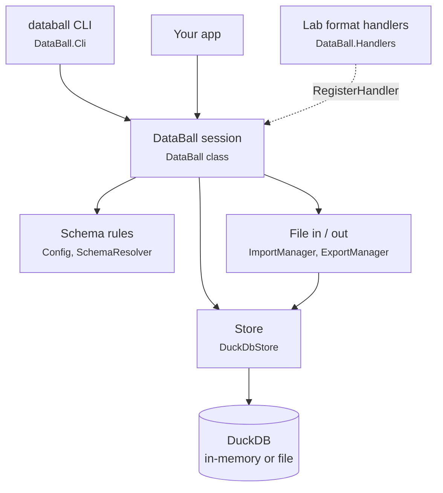

Every session holds two relations: **data** (the rows) and **meta** (key/value constants).

## 2. A session's life

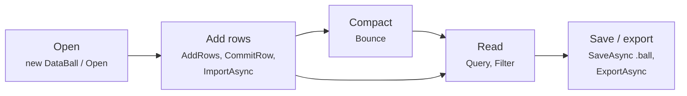

Compacting is optional. `ApplyFilter` limits what export and save write out.

## 3. Where the data lives

The working store and the file you share are two different things. By default DuckDB lives only in memory. A `.ball` is the portable copy.

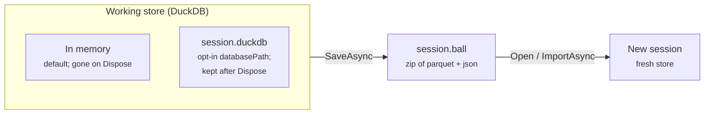

- **Share or move data as `.ball`.** Any tool can read it: unzip it and open the parquet. It is what hosts hand to each other.
- **A `.duckdb` file is the working engine, not an interchange format.** Reopen it with `new DataBall(databasePath: ...)`. A layout session needs the same `tables` config. Never point this at `catalog.duckdb`.

## 4. Imports are all-or-nothing

Every import runs inside one transaction. If it fails, the session is left exactly as it was, and that includes config and metadata. Source: `DataBall.cs` (`RunImport`).

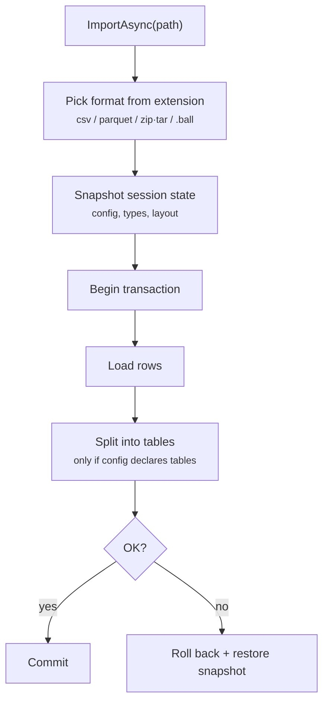

## 5. CSV headers become typed columns

A header such as `EVM(dB)` becomes a column named `EVM` of type double. Source: `HeaderParser.cs`, `SchemaResolver.cs`, `Config.cs`.

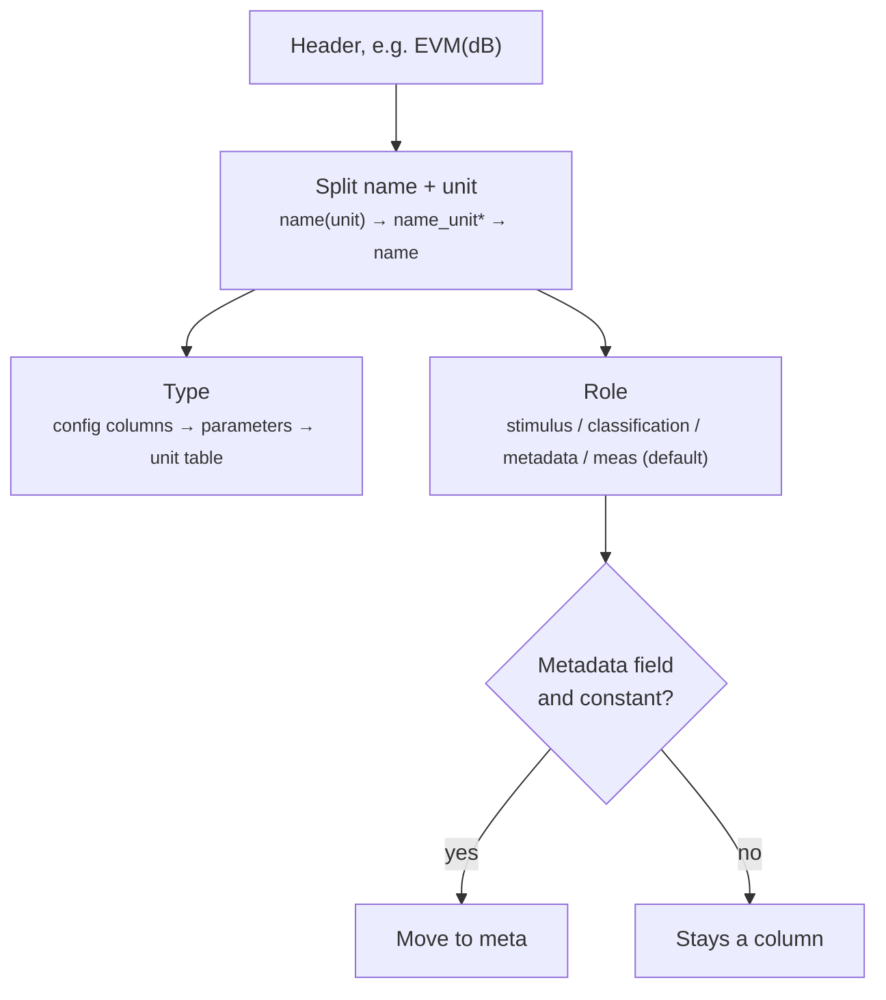

\* `name_unit` splits only when the suffix is a known unit, so `I_Total` stays whole.

Metadata fields (defaults `Lot`, `Tester`, `Program`) follow `metadataPolicy`. Under `requireConstant`, a field that varies throws. Under `first`, the first value always moves to meta.

## 6. Row builder: carry forward, reset on change

A test executive changes one setup value at a time. `InitializeRow` copies the previous row. When a **trigger** field changes, the row builder clears the fields that depend on it. Source: `DataBall.RowBuilder.cs`.

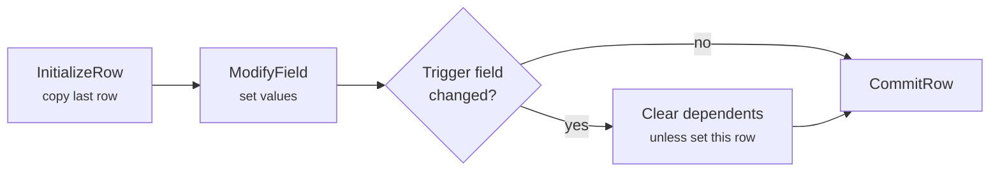

Relationships come from config, for example `{ "trigger": "Name", "reset": ["Age"] }`. `AddRow` / `AddRows` skip this logic and store rows exactly as given.

## 7. Bounce: move constants out, drop duplicates

Source: `DataBall.cs` (`Bounce`). `Squish` is the same call.

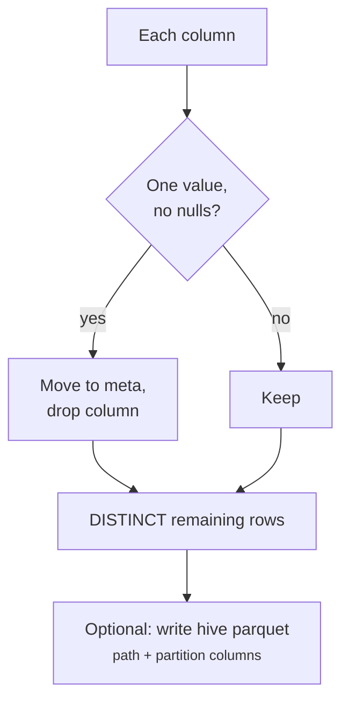

Partition columns and declared table `key` columns are never moved out. Row order is not kept.

## 8. Multi-table layout

With a `tables` section in config, the rows are stored split across several tables. **data** becomes a view that joins them back into the wide shape, so readers never notice. The example below uses the config from the README.

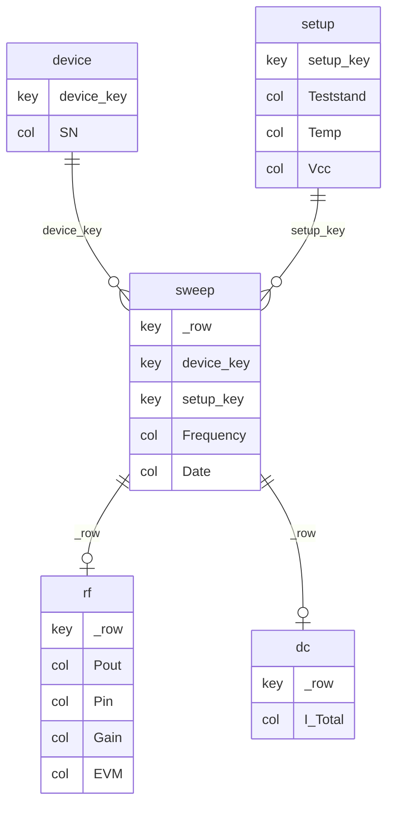

| Kind | Stores | Example |
|---|---|---|
| `master` / `dimension` | each distinct setup once, keyed by a hash of its key columns | `device`, `setup` |
| `rows` (spine) | one row per measurement point: row key `_row` plus dimension keys | `sweep` |
| `measurements` | a column group. Rows where the whole group is NULL are skipped | `rf`, `dc` |

## 9. Writing into a layout

Every write path (import, `AddRows`, `CommitRow`, merge) funnels through one routine. Source: `DuckDbStore.Layout.cs` (`AppendStagingIntoLayout`).

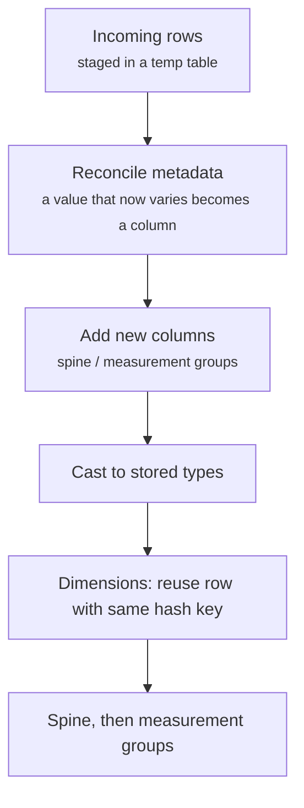

An append that would add a column to a dimension, add a new dimension, or turn varying metadata into a dimension or group column re-splits the session: the layout is materialized wide in row order, the new columns and rows are added, and the result is split again in the same transaction. `_row` is renumbered and dimension keys may change, so neither is stable (a declared-`key` dimension keeps its hash-of-key surrogate; an undeclared-key dimension gets new keys when a column is added). Existing rows get NULL in a new dimension column, so an appended row (including a `CommitRow` copy of the last row) that reuses an existing declared key with a non-NULL value there throws, because the key no longer determines the row; the session is left as it was. The re-split rewrites the whole session, so its cost grows with session size and adding a dimension column mid-capture is expensive; later appends of the same shape take the in-place path.

## 10. Whole-table edits on a layout

`AddColumn`, `RemoveColumn`, and `Bounce` all work on the wide shape. On a layout session they unsplit, apply the edit, and re-split, all inside one transaction. Source: `DataBall.cs` (`OnWideData`).

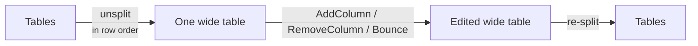

`_row` gets renumbered, so do not treat it as a stable key.

## 11. The .ball file

A `.ball` is a ZIP archive. v2 (layout sessions) adds per-table parquet files but keeps the wide `data.parquet`, so 1.2.0 readers still work. Source: `Export/ExportManager.cs`, `Import/ImportManager.cs`.

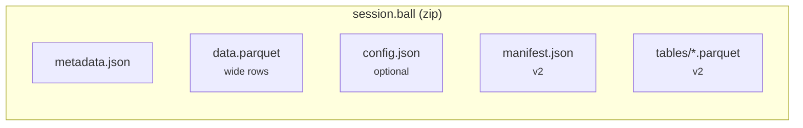

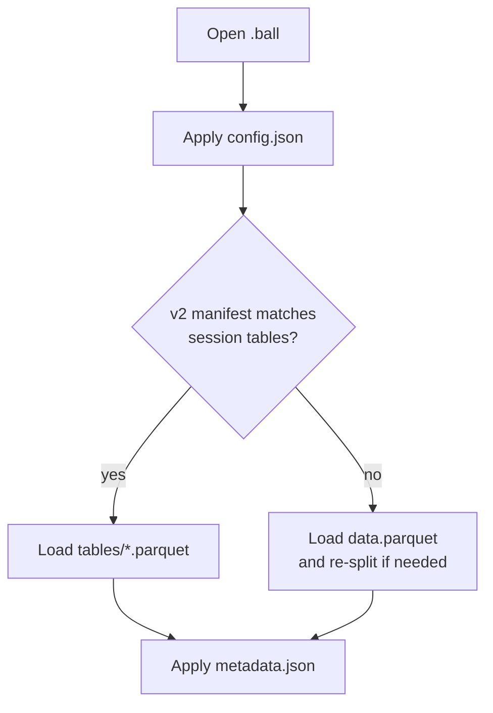
