# How DataBall works

Diagrams of the shipped library (1.3.0 in tree). Each one shows a single idea. Plain-language labels come first and the method or type name follows in small text. See the [README](../README.md) for the full rules. Source paths are relative to `src/DataBall/`.

## 1. The pieces

The CLI is only a thin shell around the library, and lab formats plug in from outside it. All state sits in one DuckDB database per session.

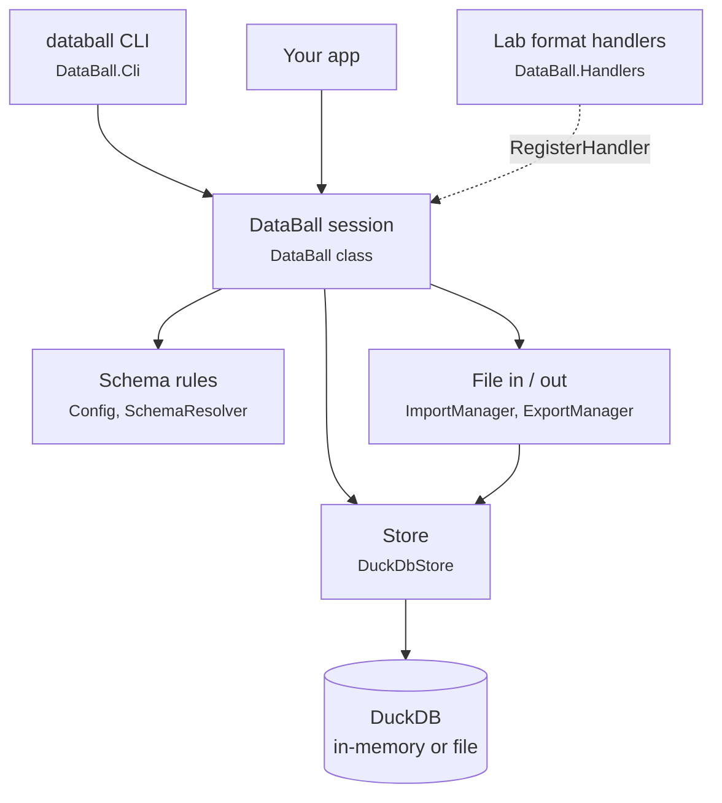

Every session holds two relations: **data** (the rows) and **meta** (key/value constants).

## 2. A session's life

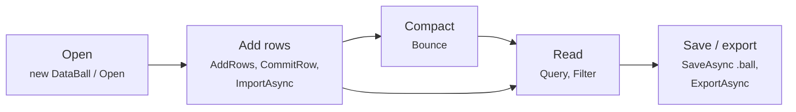

Compacting is optional. `ApplyFilter` limits CSV, Parquet, and archive exports; native saves write the whole session.

## 3. Where the data lives

A non-native `Open` / `OpenAsync` compares input bytes on disk with `EngineOptions.InMemoryMaxBytes`: at or below the threshold it uses memory, above it a temporary file. The default threshold is 25% of GC available memory. `StoreMode.Memory` or `File` overrides this choice; an empty constructor starts in memory unless forced to file. Every CLI command applies the same size rule, recursively summing directory inputs; append import counts both inputs. On `import`, `export`, `query`, and `info`, `--store auto|memory|file` selects the rule or forces a store, and `--memory-limit`, `--threads`, and `--temp-dir` forward engine settings. Temporary files live under `TempDirectory` (OS temp by default) and their database, WAL, and default spill directory are cleaned up on disposal or constructor failure; cleanup failures are logged. `MemoryLimit`, `Threads`, and spill `TempDirectory` go through the DuckDB connection builder; null retains engine defaults. Engine options are never persisted in config. Native `.ball` opens ignore mode and threshold but apply the other settings. A `.ball` is a native DuckDB file: open it directly as a read-only session, or request `writable: true`. Save produces a compact whole-session copy.

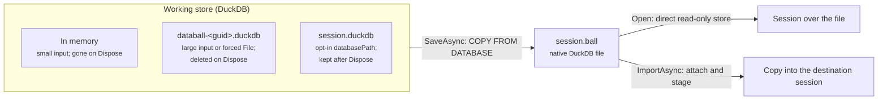

- **Share or move data as `.ball`.** Open it with DataBall or DuckDB; config and metadata travel inside the database.
- **An explicit file-backed working store persists after disposal.** Reopen it with `new DataBall(databasePath: ...)`; its stored config binds the layout. Never point this at `catalog.duckdb`.

## 4. Imports are all-or-nothing

Every import runs inside one transaction. If it fails, the session is left exactly as it was, and that includes config and metadata. Source: `DataBall.cs` (`RunImport`).

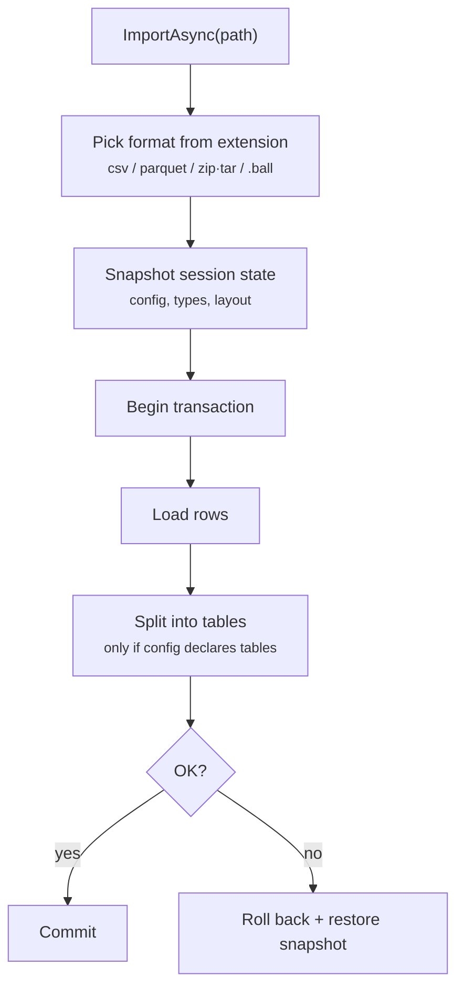

## 5. CSV headers become typed columns

A header such as `EVM(dB)` becomes a column named `EVM` of type double. Source: `HeaderParser.cs`, `SchemaResolver.cs`, `Config.cs`.

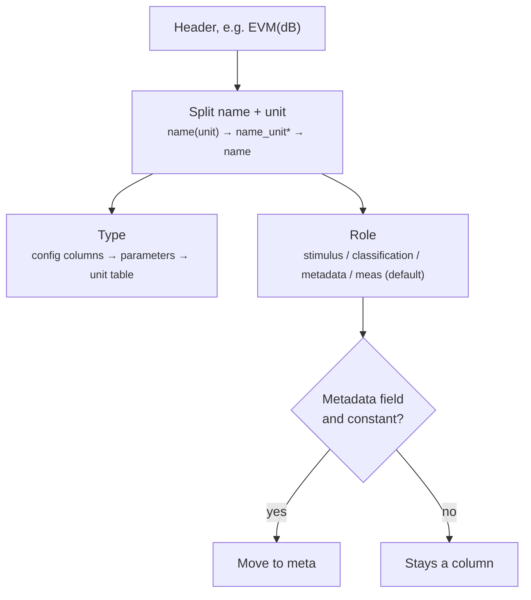

\* `name_unit` splits only when the suffix is a known unit, so `I_Total` stays whole.

Metadata fields (defaults `Lot`, `Tester`, `Program`) follow `metadataPolicy`. Under `requireConstant`, a field that varies throws. Under `first`, the first value always moves to meta.

## 6. Row builder: carry forward, reset on change

A test executive changes one setup value at a time. `InitializeRow` copies the previous row. When a **trigger** field changes, the row builder clears the fields that depend on it. Source: `DataBall.RowBuilder.cs`.

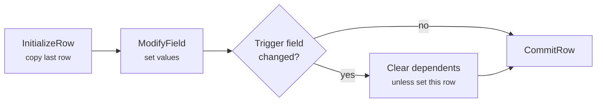

Relationships come from config, for example `{ "trigger": "Name", "reset": ["Age"] }`. `AddRow` / `AddRows` skip this logic and store rows exactly as given.

## 7. Bounce: move constants out, drop duplicates

Source: `DataBall.cs` (`Bounce`). `Squish` is the same call.

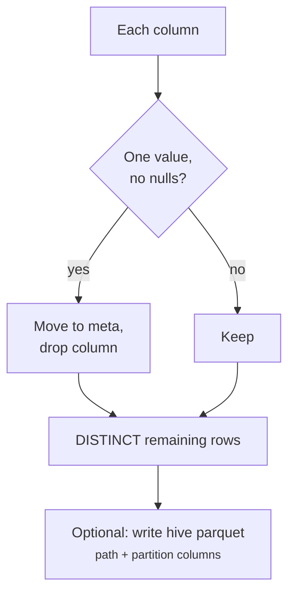

Partition columns and declared table `key` columns are never moved out. Row order is not kept.

## 8. Multi-table layout

With a `tables` section in config, the rows are stored split across several tables. **data** becomes a view that joins them back into the wide shape, so readers never notice. The example below uses the config from the README.

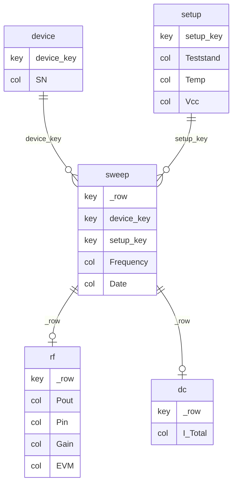

| Kind | Stores | Example |
|---|---|---|
| `master` / `dimension` | each distinct setup once, keyed by a hash of its key columns | `device`, `setup` |
| `rows` (spine) | one row per measurement point: row key `_row` plus dimension keys | `sweep` |
| `measurements` | a column group. Rows where the whole group is NULL are skipped | `rf`, `dc` |

## 9. Writing into a layout

Every write path (import, `AddRows`, `CommitRow`, merge) funnels through one routine. Source: `DuckDbStore.Layout.cs` (`AppendStagingIntoLayout`).

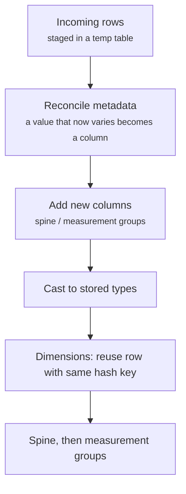

An append that would add a column to a dimension, add a new dimension, or turn varying metadata into a dimension or group column re-splits the session: the layout is materialized wide in row order, the new columns and rows are added, and the result is split again in the same transaction. `_row` is renumbered and dimension keys may change, so neither is stable (a declared-`key` dimension keeps its hash-of-key surrogate; an undeclared-key dimension gets new keys when a column is added). Existing rows get NULL in a new dimension column, so an appended row (including a `CommitRow` copy of the last row) that reuses an existing declared key with a non-NULL value there throws, because the key no longer determines the row; the session is left as it was. The re-split rewrites the whole session, so its cost grows with session size and adding a dimension column mid-capture is expensive; later appends of the same shape take the in-place path.

## 10. Whole-table edits on a layout

`AddColumn`, `RemoveColumn`, and `Bounce` all work on the wide shape. On a layout session they unsplit, apply the edit, and re-split, all inside one transaction. Source: `DataBall.cs` (`OnWideData`).

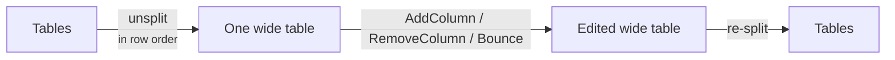

`_row` gets renumbered, so do not treat it as a stable key.

## 11. The .ball file

A `.ball` v3 is a DuckDB database. `Open` checks native magic before handlers, opens read-only by default, reads the latest `_databall` config row, and binds the stored layout. An overlay must describe the same tables. Public write methods reject read-only sessions before changing session state. ZIP `.ball` v1/v2 support is removed.

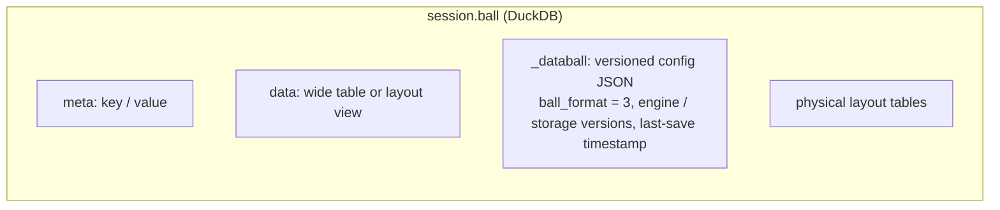

`SaveAsync` ignores session filters and saves all rows. It attaches a temporary destination, uses `COPY FROM DATABASE`, detaches it, and replaces the destination. Saving a writable session to its own live path runs `CHECKPOINT`. Filters apply to CSV, Parquet, and archive export.

Native `ImportAsync` attaches the source read-only, merges the schema config subset, stages its wide `data`, routes rows through the existing merge/append path, and loads metadata with config metadata taking precedence. All changes commit together or roll back together. Detach runs after commit or rollback because DuckDB prohibits it while the transaction has outstanding reads.

Config history appends only when merged config changes; the highest version is current. `_databall` and `meta` are reserved table names. DuckDB's default storage version is retained; no older-engine reader floor is claimed. The same-path in-process gate also applies to read-only opens. Cross-process snapshot publication is outside this change.

Native saves stamp the latest `_databall` row with the running engine's `version()`, the destination's actual `duckdb_databases()` storage tag, and `written_at` (time of that save). The engine and storage versions are read after the database copy and before detach. Saving a writable session to its own file stamps that row before checkpointing. Config history grows only when config changes, including a read-only overlay saved to a copy. A read-only session cannot save to its own path (it throws); save to another path, or open with `writable: true`.

`Open` uses the full stored config; an overlay merges on top and must keep the same table layout (table order does not matter). Stored `meta` values are authoritative on reopen; only overlay metadata overrides them, in memory for a read-only session. Native `ImportAsync` merges only columns, relationships, tables, and config metadata. The receiving session keeps its CSV settings, metadata fields, metadata policy, and other settings.

Dimension-growth re-splits materialize the ordered view once, rename that table to `data`, and use `data` directly as split input. The `_cast` staging table is still a full wide TEMP copy held in memory. Dropped tables are retained until commit, so dropping the source early does not lower the peak inside the transaction. This removes the extra `_unsplit` and `_wide` copies; the whole-session rewrite still runs in one transaction.
